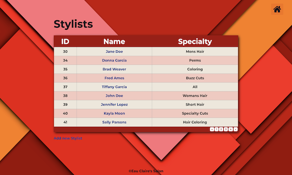

# **Eau Claires's Salon**

###### By Trevor Mackin 01/17/2020  

### **Description**
_This is a server-side application built in C# using the ASP.Net Core Mvc framework. The project focuses on connecting to a database using the Entity Framework (Core). The application is meant to be for a Salon owner to keep track of their stylists, and the clients that belong to each stylist individually. When a user runs the application, they should be welcomed on a splash page and given a link to view all stylist. From here, the user should be able to navigate to a page showing all the stylists with CRUD functionality, allowing a user to Add, Edit and Delete a stylist. When the user clicks on a particular stylist they will be presented with a list of clients for that specific stylist. From the list of clients, a user can then click on a specific client to view further details of the client as well. The application also provides all CRUD functionality for each of the clients._
#

###  **Setup/Installation Requirements**
1. Open https://ratta2ii.github.io/HairSalon.Solution
2. Clone repository to local machine
3. Navagate to the project directory (HairSalon)
4. $ dotnet restore (step 5 will auto restore as well)
5. $ dotnet run (to run the application in the browser)
#

### **SQL Statements (Database)**

##### Statement 1
CREATE TABLE `stylists` (
  `StylistId` int(11) NOT NULL AUTO_INCREMENT,
  `Name` varchar(255) DEFAULT NULL,
  `Specialty` varchar(255) DEFAULT NULL,
  PRIMARY KEY (`StylistId`)
) ENGINE=InnoDB AUTO_INCREMENT=6 DEFAULT CHARSET=utf8mb4 COLLATE=utf8mb4_0900_ai_ci;

##### Statement 2

CREATE TABLE `clients` (
  `ClientId` int(11) NOT NULL AUTO_INCREMENT,
  `Name` varchar(255) DEFAULT NULL,
  `StylistId` int(11) DEFAULT '0',
  PRIMARY KEY (`ClientId`)
) ENGINE=InnoDB AUTO_INCREMENT=6 DEFAULT CHARSET=utf8mb4 COLLATE=utf8mb4_0900_ai_ci;
#

### **Technologies Used**
* C#
* netcoreapp2.2
* ASP.NET Core Mvc
* Razor
* Entity Framework (Core)
* Html
* Css
* Bootstrap

#
### **License**

Copyright (c) 2019 **Trevor Mackin**